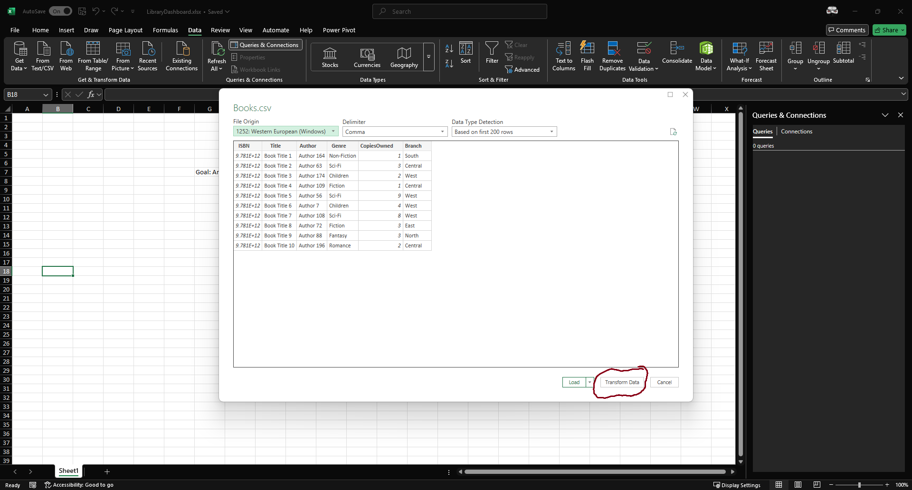
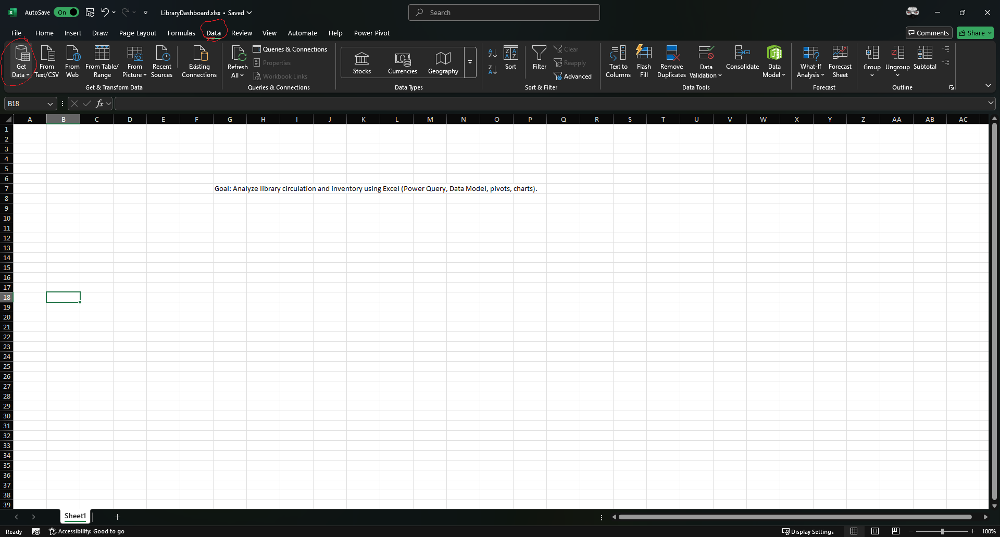
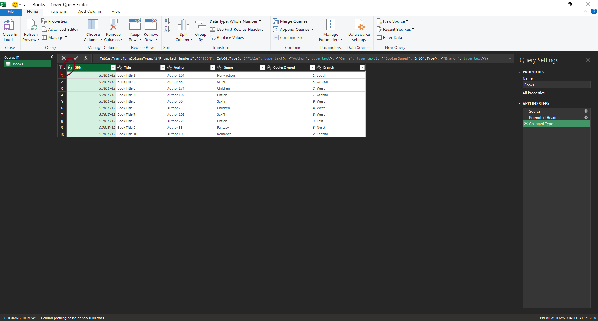
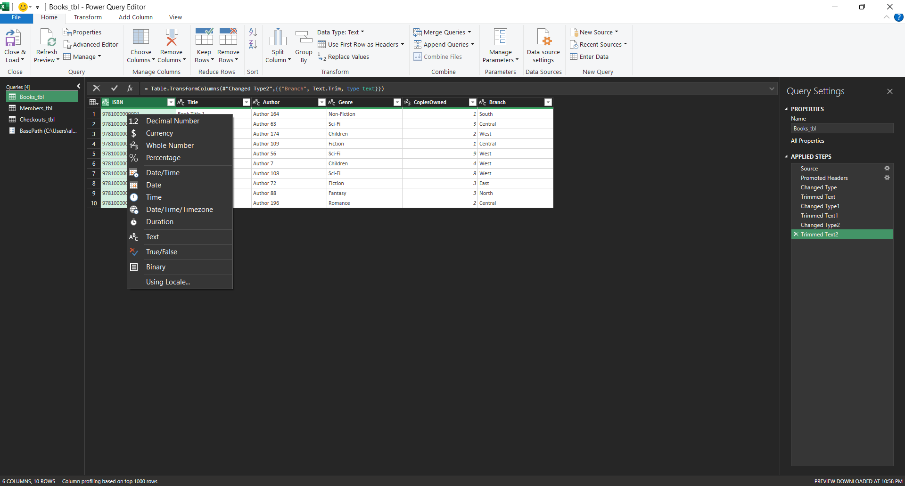
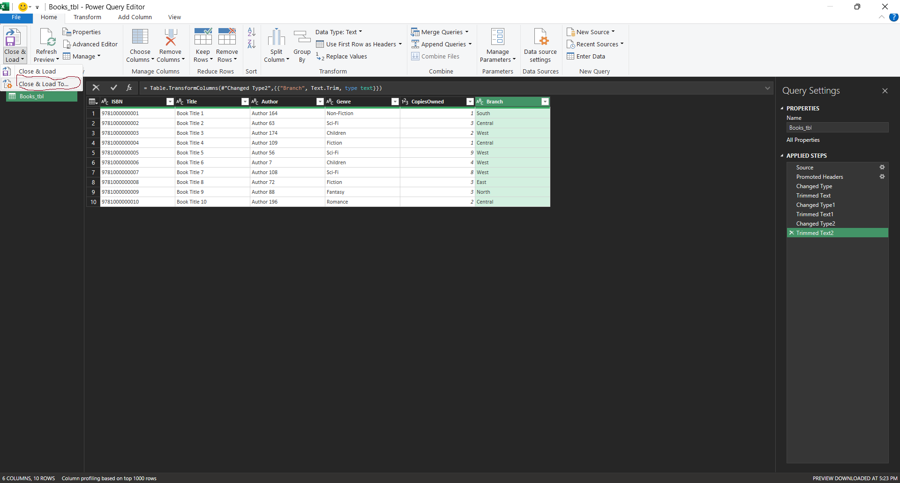
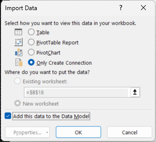
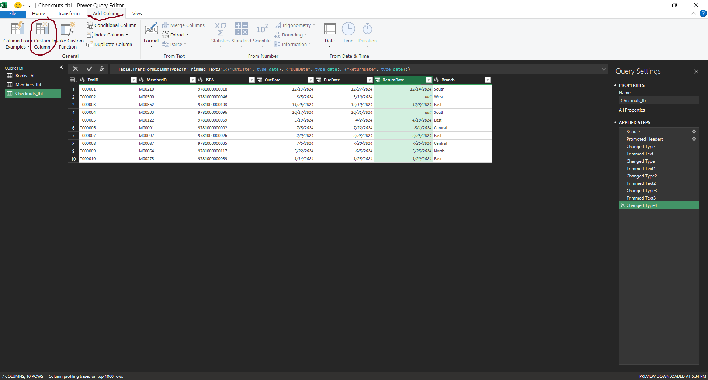
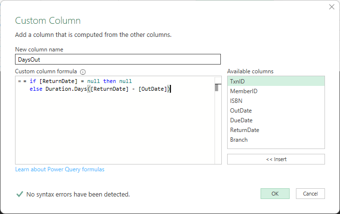
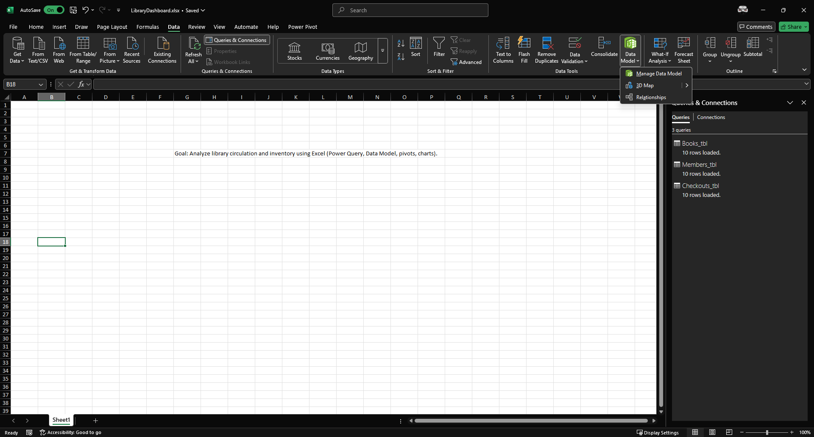
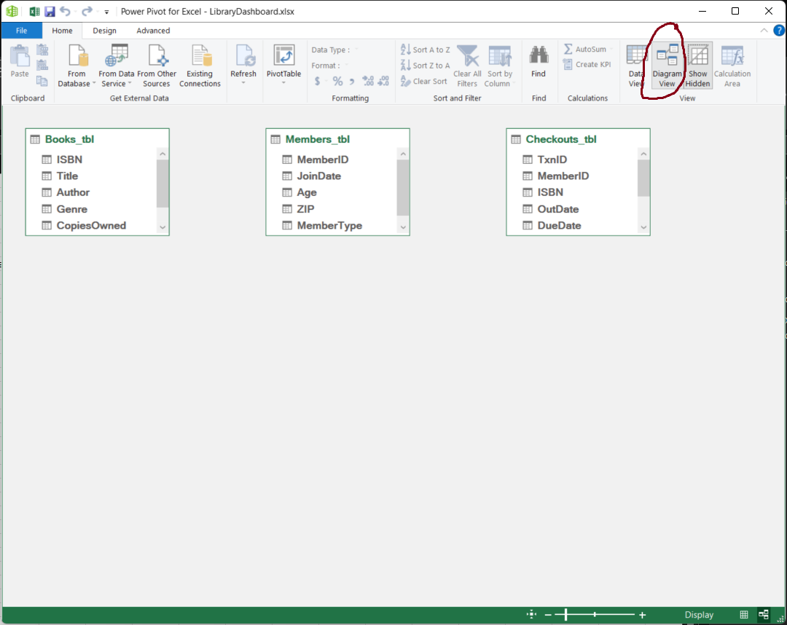

# Day 1 Report – Library Insights Dashboard (Excel Project)

**Date:** 2025-07-23  
**Goal:** Set up the workbook, import/clean raw CSVs with Power Query, and load them into the Data Model.

---

## 1. Folder & File Setup
```
Excel-Project/
  Excel/
    LibraryDashboard.xlsx
  Raw_Data/
    Books.csv
    Members.csv
    Checkouts.csv
  Reports/
    # images, notes, for each day etc.
```


- Placed the three CSVs inside **/RawData**.

---

## 2. Workbook Initialization
- Opened Excel → saved as **LibraryDashboard.xlsx** in `LibraryProject`.
- Renamed **Sheet1** to **ReadMe** and wrote a short project purpose.

---

## 3. Import & Clean: `Books.csv`
**Data → Get Data → From Text/CSV → Transform Data**






Power Query steps:
- Renamed query to **Books_tbl**.  
- Data types: `ISBN`, `Title`, `Author`, `Genre`, `Branch` → **Text**; `CopiesOwned` → **Whole Number**.  
- The pictures demonstrate how to do it for ISBN; the same proccess applies to all




- (Optional) **Transform → Format → Trim** on text columns.  
.png)

- **Close & Load To…** → **Only Create Connection** + **Add to Data Model**.





---

## 4. Import & Clean: `Members.csv`
- Renamed query to **Members_tbl**.  
- Data types: `MemberID`, `ZIP`, `MemberType` → **Text**; `JoinDate` → **Date**; `Age` → **Whole Number**.  
- Optional Trim on text columns.  
- Loaded as connection only + to Data Model.

---

## 5. Import & Clean: `Checkouts.csv`
- Renamed query to **Checkouts_tbl**.  
- Data types: `TxnID`, `MemberID`, `ISBN`, `Branch` → **Text**; `OutDate`, `DueDate`, `ReturnDate` → **Date**.  
- Added helper column **DaysOut**:

```m
= if [ReturnDate] = null then null 
  else Duration.Days([ReturnDate] - [OutDate])
```



### Breakdown of the formula
---
We want to know how many days a book was checked out.

That’s simply: ReturnDate – OutDate.

But sometimes a book isn’t back yet, so ReturnDate is blank (null). In that case, we can’t subtract, so we just leave the result blank (null).


if [ReturnDate] = null then null

“If there’s no return date, don’t try to calculate—just leave this cell empty.”

else Duration.Days([ReturnDate] - [OutDate])

“Otherwise, subtract OutDate from ReturnDate, and convert that time difference into a number of days.”

Duration.Days(...): Power Query stores dates as date/time “durations.” This function extracts just the count of days, so you see a simple whole number like 12.


Otherwise without the Duration.Days() function the result would be `12:00:00:00`, in the format days:hours:mins:sec


- Set **DaysOut** to **Whole Number**.  
- Loaded as **connection only** + **to Data Model**.

## 6. Data Model Verification
- **Data → Manage Data Model (Power Pivot)**  
- In **Diagram/Data View**: confirmed all 3 tables exist.  
- Manually checked key columns (`ISBN`, `MemberID`) for blanks/obvious issues (sort/filter).  
- **Relationships** will be created on **Day 2**.





## 7. Documentation & Reflection
- Updated **ReadMe** with imported files, cleaning steps, and the helper column.  
- Noted any null `ReturnDate` rows and possible duplicates to review later.  
- Saved workbook (v1). Optional **“DataPeek”** sheet created by duplicating queries for visual checks.

## Pending / Next Day Tasks
- Create relationships between tables (`ISBN`, `MemberID`).  
- Define KPIs (Turnover Rate, Overdues, Avg Days Out).  
- Build first PivotTables and slicers.

