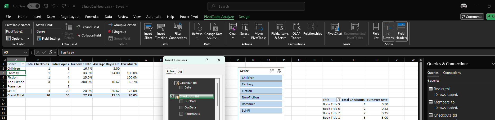

# Day 3 Report — Calendar, Slicers, KPIs, Top-10, and Overdue Chart
**Date:** 2025-07-24

**Goal:** Make the model time-aware, tidy dimensions, and build interactive visuals (KPIs row, Top-10 Titles, and Overdue % by Genre × Branch).
---

# Goal of this project

Build a small, production-style Library Insights Dashboard in Excel that turns three flat CSVs (Books, Members, Checkouts) into clean, connected, decision-ready insights. You’ll practice the end-to-end workflow used in real analytics work:

- Data hygiene & structure: Import raw CSVs with Power Query, clean/reshape (types, trims, helper columns like DaysOut), and load to the Data Model.

- Modeling: Create a simple star schema (Books & Members → Checkouts) plus a proper Calendar and a Branch dimension for clean filtering.

- Measures (DAX): Define reusable KPIs—Total Checkouts, Total Copies, Turnover Rate, Average Days Out, Overdue %, Active Members/Titles—that recalc under any filter.

- Interactive analysis: Build a Dashboard with PivotTables/Charts, slicers (Branch/Genre/Member Type) and a timeline to explore results by segment and time.

- Versioned deliverable: Save repeatable steps in the workbook, document them in Markdown, and commit to GitHub so the project is portable and auditable.

## What “done” looks like

- A single Excel file where changing Branch/Genre/Member Type/Date instantly updates KPIs, a Top-10 Titles view, and an Overdue % by Genre × Branch chart.

- Clean, documented queries and relationships that refresh when new CSVs (or new months/years) are dropped in.

- A concise README explaining the model, measures, and how to use the dashboard.

## Why this matters
This project helps practicing the whole analyst loop—ingest → model → measure → visualize → publish—while leveling up Excel skills (Power Query, Data Model, DAX, pivots/slicers) that transfer directly to Power BI and real-world reporting.


## What has been Done so far
- From Day 1: Clean tables and a solid Data Model.
- From Day 2: Core measures (Total Checkouts, Total Copies, Turnover Rate, Avg Days Out, Overdue %, etc.) and working relationships.
- Today:
    - Calendar_tbl (marked as the Date Table) and relationships to Checkouts_tbl[OutDate].
    - Branch dimension (Books_dim[Branch]) from Books → used for branch slicer.
    - Single Calendar timeline controlling everything; removed old OutDate timeline.
    - KPI row (formatted measures).
    - Top-10 Titles pivot.
    - Overdue % by Genre × Branch pivot + chart.
--- 

## 1) Build a proper Calendar in Power Query
### 1.1 Create a Blank Query
- Data → Get Data → From Other Sources → Blank Query

- Home → Advanced Editor and replace all text with the code below.
### 1.2  code (dynamic range from Checkouts_tbl[OutDate])
```
let
  // use your existing query name exactly:
  Source = Checkouts_tbl,

  // collect all non-null dates from these columns
  AllDates =
    List.RemoveNulls(
      List.Combine({
        try Table.Column(Source, "OutDate") otherwise {},
        try Table.Column(Source, "DueDate") otherwise {},
        try Table.Column(Source, "ReturnDate") otherwise {}
      })
    ),

  MinDate = Date.StartOfYear(List.Min(AllDates)),
  MaxDate = Date.EndOfYear(List.Max(AllDates)),

  DayCount = Duration.Days(MaxDate - MinDate) + 1,
  Dates = List.Dates(MinDate, DayCount, #duration(1,0,0,0)),
  Tbl = Table.FromList(Dates, Splitter.SplitByNothing(), {"Date"}),

  Typed = Table.TransformColumnTypes(Tbl, {{"Date", type date}}),

  AddYear = Table.AddColumn(Typed, "Year", each Date.Year([Date]), Int64.Type),
  AddMonth = Table.AddColumn(AddYear, "Month", each Date.Month([Date]), Int64.Type),
  AddMonthName = Table.AddColumn(AddMonth, "MonthName", each Date.ToText([Date], "MMMM"), type text),
  AddQuarter = Table.AddColumn(AddMonthName, "Quarter", each "Q" & Text.From(Date.QuarterOfYear([Date])), type text),

  // helpful sort keys
  AddMonthIndex = Table.AddColumn(AddQuarter, "MonthIndex", each Date.Year([Date]) * 100 + Date.Month([Date]), Int64.Type),
  AddYearMonth = Table.AddColumn(AddMonthIndex, "YearMonth", each Date.ToText([Date], "yyyy-MM"), type text)
in
  AddYearMonth

```


### 1.3 Name & Load
- Rename query to `Calendar_tbl`.
- Home → Close & Load To…
    - Only Create Connection
    - Add this data to the Data Model


### 1.4 Mark as Date Table (Power Pivot)
- Data → Manage Data Model (opens Power Pivot)
    - Open Diagram View
    - Connect `Calendar_tbl` to `checkout_tbl` via thier `Date` (1→*). Similar process as Day 2.


- Select Calendar_tbl → Design → Mark as Date Table… → Column: Date → OK


- (Optional) In Data View, set MonthName → Sort by Column → Month (so Jan, Feb, …).


## (2) Create a clean Branch dimension (from Books)
We want a single Branch slicer that filters both inventory and activity. The clean way is a dimension with unique branches.

### 2.1 Reference Books_tbl in Power Query
- Right-click Books_tbl → Reference → rename to Books_dim.
    - Data -> Querrries and connections


- Keep only the Branch column: Home → Choose Columns.


- Transform → Format → Trim (and Clean if available)
- Remove Duplicates (Home tab).
  


### 2.2 Load to model & wire it
- Close & Load To… → Only Create Connection + Add to Data Model.


- In Power Pivot → Diagram View:
    - Link Books_dim[Branch] → Checkouts_tbl[Branch] (1→*).


## 3)  One timeline + three slicers
### 3.1 Insert a single timeline (Calendar Date)
- Click inside any pivot (or create a placeholder pivot from the model).
- PivotTable Analyze → Insert Timeline → choose Calendar_tbl[Date].
- Place it near the top; set Time Level = Months.

  
### 3.2 Insert slicers
- PivotTable Analyze → Insert Slicer
    - Books_dim[Branch] (label it just Branch)
    - Books_tbl[Genre]
    - Members_tbl[MemberType]
- Right-click each slicer → Slicer Settings → set Display header captions nicely.


### 3.3 Connect all controls to all pivots/charts
- Select a pivot → PivotTable Analyze → Report Connections (or Filter Connections).
- Tick your Timeline and all slicers. Repeat for each pivot.

## 4  KPI Row (cards)
We’ll display existing measures built on Day 2:
```
[Total Checkouts] = DISTINCTCOUNT(Checkouts_tbl[TxnID])

[Total Copies] = SUM(Books_tbl[CopiesOwned])

[Turnover Rate] = DIVIDE([Total Checkouts], [Total Copies])

[Average Days Out] = AVERAGEX(FILTER(Checkouts_tbl, NOT ISBLANK(Checkouts_tbl[DaysOut])), Checkouts_tbl[DaysOut])

[Overdue Count] = the VAR / FILTER measure you created

[Overdue %] = DIVIDE([Overdue Count], [Total Checkouts])
```

### 4.1 Create the pivot for KPIs
- Insert → PivotTable → From Data Model → place on Dashboard.

- Values: Add the 5 measures above (usually omit [Overdue Count] from the card row; keep it for charts).

- Design
    - Subtotals → Do Not Show
    - Grand Totals → Off for Rows and Columns
    - Report Layout → Show in Tabular Form (optional)
    - PivotTable Analyze → Field Headers → Off (for a “card” look)

## 5 Top-10 Titles by Checkouts
### 5.1 Pivot setup
- Insert → PivotTable → From Data Model (on Dashboard).
- Rows: Books_tbl[Title]
- Values: [Total Checkouts]
- Row Label filter: Value Filters → Top 10…
    - Top 10 Items by Sum of Total Checkouts
- Sort Largest to Smallest (Row Labels → Sort).

## 6 Overdue % by Genre × Branch (+ Chart)
### 6.1 Create the matrix pivot
- Rows: Books_tbl[Genre]
- Columns: Books_dim[Branch]
- Values: [Overdue %] (format as Percentage, 1 decimal)
- 
Cleanup
- Subtotals: Off
- Grand Totals: Off
- If you see ######, widen the columns (or Home → Format → AutoFit Column Width).

### 6.2  Add a PivotChart
- PivotTable Analyze → PivotChart → Clustered Column
- Title: Overdue % by Genre × Branch
- Select Y-axis → Number Format → Percentage (1 decimal)
- Connect the chart’s pivot via Filter Connections (or Report Connections) to Timeline + Slicers.

# Final Results for the day


---


# Additional Info

## Slicers (what & why)
- What they are: Big clickable buttons that filter your pivots/charts without opening any menus. Think of them like on/off chips for Branch, Genre, or Member Type.
- Why they matter: They make your dashboard interactive and consistent. One slicer can control multiple pivots at once (via Report Connections), so every number and chart changes together—no mismatched views.

## Timeline (what & why)
- What it is: A special slicer for dates. You can slide or select months/quarters/years.
- Why it matters: Time is the backbone of almost every report. The timeline connected to our Calendar table lets you ask questions like:
    - “Show only Q1”
    - “Compare March vs April”
    - “What happened this summer?”

Using the Calendar table (marked as a Date Table) ensures time logic works correctly and avoids gaps or weird sorting (e.g., “Apr, Aug, Dec” vs “Jan, Feb, …”).

## KPIs (Key Performance Indicators)
- What they are: The handful of headline metrics you watch all the time—your dashboard “speedometer.”

- In this project we built:
    - Total Checkouts – how much borrowing activity happened
    - Total Copies – how much inventory you own
    - Turnover Rate = Total Checkouts ÷ Total Copies (demand vs supply)
    - Average Days Out – how long items are kept on average (service speed)
    - Overdue % – share of late returns (service quality/compliance)

- Why they matter: KPIs summarize the system in one glance. If a KPI moves, you drill down with the other visuals (Top 10, branch/genre breakdowns) to find the “why.”

## PivotTable vs PivotChart (and why both)
- PivotTable: A powerful summary table. You can group, filter, sort, and add measures quickly (e.g., Overdue % by Genre × Branch).
- PivotChart: A visual on top of the pivot (bar, column, line…). It’s easier to spot patterns, compare groups, and present to others.
- Why this combo matters: Tables are precise; charts are fast for the eyes. On a dashboard you usually want both—a chart to spot the issue and a table next to it to confirm exact values.

## “Top 10 Titles” (what & why)
- What it is: A pivot filtered to show the 10 most-borrowed titles.
- Why it matters: Focus drives action. Instead of drowning in 1,000 titles, you immediately see where most demand is.
- Use it to:
    - Identify hits that might need more copies
    - Spot seasonal trends via the Timeline
    - Compare by Branch/Genre with slicers

## Explanantion of the code used in the Advanced Query Editor to Create Calendar_tbl
A clean, continuous, duplicate-free list of dates that automatically spans your real data window (based on OutDate, DueDate, and ReturnDate), with handy columns (Year, Month, MonthName, Quarter, YearMonth, MonthIndex) for sorting, grouping, and timelines.

```
Source = Checkouts_tbl,
```
- Uses your already-cleaned Checkouts query as the source, so you don’t hardcode any paths.

``` AllDates =
  List.RemoveNulls(
    List.Combine({
      try Table.Column(Source, "OutDate") otherwise {},
      try Table.Column(Source, "DueDate") otherwise {},
      try Table.Column(Source, "ReturnDate") otherwise {}
    })
  ),
```
- Pulls all non-null dates from three columns at once.
- try … otherwise {} keeps the script robust even if one column is missing/renamed.
- Including Due and Return dates ensures your calendar covers late returns or due dates that might extend past OutDates.


``` 
MinDate = Date.StartOfYear(List.Min(AllDates)),
MaxDate = Date.EndOfYear(List.Max(AllDates)),
```
- Finds the actual min/max in your data and then rounds to full years so the calendar covers whole years (Jan 1 → Dec 31). That makes month/quarter filters behave predictably.
  

```DayCount = Duration.Days(MaxDate - MinDate) + 1,
Dates = List.Dates(MinDate, DayCount, #duration(1,0,0,0)),
Tbl = Table.FromList(Dates, Splitter.SplitByNothing(), {"Date"}),
Typed = Table.TransformColumnTypes(Tbl, {{"Date", type date}}),
```
- Generates a continuous daily series with no gaps and no duplicates. This is critical: the Date table must have one row per day and only one row per day.

```
AddYear   = Table.AddColumn(Typed, "Year",       each Date.Year([Date]),   Int64.Type),
AddMonth  = Table.AddColumn(AddYear, "Month",    each Date.Month([Date]),  Int64.Type),
AddMonthName = Table.AddColumn(AddMonth, "MonthName", each Date.ToText([Date], "MMMM"), type text),
AddQuarter   = Table.AddColumn(AddMonthName, "Quarter", each "Q" & Text.From(Date.QuarterOfYear([Date])), type text),
```
- Adds friendly grouping fields you’ll use in pivots and slicers: Year, Month number, Month name, Quarter.

``` 
AddMonthIndex = Table.AddColumn(AddQuarter, "MonthIndex", each Date.Year([Date]) * 100 + Date.Month([Date]), Int64.Type),
AddYearMonth  = Table.AddColumn(AddMonthIndex, "YearMonth", each Date.ToText([Date], "yyyy-MM"), type text)
```
- Creates sort keys:
    - MonthIndex = YYYY*100 + MM → perfect for sorting MonthName within a year.
    - YearMonth (2024-03) → great for tidy axis labels or table groupings.

Result: You end with a table whose primary key is Date, and supporting columns for clean slicers, timelines, and grouping.


## Why this approach is important
1. It’s dynamic and future-proof
The range grows with your data; no manual edits when 2025 checkouts arrive.

2. It gives a true Date table
    - One row per day, no duplicates → Excel/Power Pivot lets you Mark as Date Table.
    - A proper Date table is required for timelines and stable month/quarter/year logic.

3. It prevents timeline weirdness
    - You get all days, even when there were no checkouts that day—so April really means all of April, not just the days with activity.

4. It supports clean sorting/grouping
    - MonthName + Sort by Column → Month (or MonthIndex) gives Jan→Dec order, not alphabetical.

5. It captures full business window
    - Using Out/Due/Return covers edge cases (e.g., long loans, late returns) so your timeline brackets reality.

### More Questions on why it is needed
---
#### why did we have to use that long formula to make calendaer_tbl and what is its importance
we needed a proper, continuous, duplicate-free list of dates that automatically stretches to cover your data. That’s what the “long” Power Query (M) script builds. It’s the backbone for your timeline, proper month/quarter/year grouping, and any time-based measures later.

#### Why not just use OutDate from Checkouts?
- Duplicates: OutDate repeats (many checkouts on the same day). A Date Table must have one row per date.
- Gaps: If you use only the dates that appear in Checkouts, the timeline will skip days with no activity. That breaks “show this whole month” behavior and can mess with month sorting/labels.
- Not future-proof: When you add new data (next month/year), a hardcoded list won’t expand. The M code auto-expands to the new min/max.
- Mark as Date Table: Excel requires a single column of unique date values. A fact column like OutDate doesn’t qualify.

# How these pieces work together
- The Calendar timeline defines when.
- The Branch/Genre/Member Type slicers define where and who.
- The KPIs show the high-level result given those filters.
- The Top 10 tells you which items drive the result.
- The Overdue % by Genre × Branch (pivot + chart) tells you where problems or strengths are concentrated.

Because they all connect to the same data model and are hooked to the same slicers/timeline, every element updates in sync. That coherence is what makes a dashboard trustworthy.


# Why today’s work is important to the overall project
1. We made time a first-class citizen.
    - Building a proper Calendar table and marking it as a Date Table unlocks correct month/quarter/year behavior, sorting, and timeline filtering. Any future metric (trend lines, YoY, period-to-date) will rely on this.

2. We cleaned the filtering layer.
    - Creating a Branch dimension (Books_dim) gives us a single, unique list of branches that filters activity and inventory reliably. That avoids duplicate values, inconsistent filters, and broken pivots later.

3. We turned raw numbers into decisions.
    - KPIs, Top 10, and the Overdue breakdown convert data into answers to real questions:

        - Do we have enough copies? (Turnover)
        - Are loans returning on time? (Overdue %, Avg Days Out)
        - Which titles/genres/branches need attention? (Top 10, Genre × Branch)

4. We built an interactive, reusable dashboard.
    - With slicers and timeline in place, your dashboard is self-serve. Anyone can change month, branch, or member type and instantly see what changes—no editing formulas.

5. We set up a scalable foundation.
    - The model (relationships + dimensions + measures) means you can:
        - Load 2025 data and everything still works
        - Add new visuals (e.g., YoY growth, Peak hours) with minimal rework
        - Keep your ReadMe and GitHub organized for collaboration and versioning