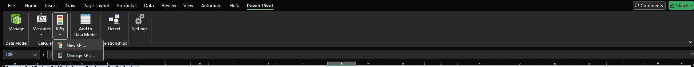

# Day 5 

**Date:** 2025-08-15
**Goal:**  Add service-quality metrics and KPI tracking, surface “Top 10 Titles,” and wire everything to slicers/timeline so managers can monitor performance at a glance.

# Goal of this project

Build a small, production-style Library Insights Dashboard in Excel that turns three flat CSVs (Books, Members, Checkouts) into clean, connected, decision-ready insights. You’ll practice the end-to-end workflow used in real analytics work:

- Data hygiene & structure: Import raw CSVs with Power Query, clean/reshape (types, trims, helper columns like DaysOut), and load to the Data Model.

- Modeling: Create a simple star schema (Books & Members → Checkouts) plus a proper Calendar and a Branch dimension for clean filtering.

- Measures (DAX): Define reusable KPIs—Total Checkouts, Total Copies, Turnover Rate, Average Days Out, Overdue %, Active Members/Titles—that recalc under any filter.

- Interactive analysis: Build a Dashboard with PivotTables/Charts, slicers (Branch/Genre/Member Type) and a timeline to explore results by segment and time.

- Versioned deliverable: Save repeatable steps in the workbook, document them in Markdown, and commit to GitHub so the project is portable and auditable.


# What’s been done so far
- Day 1: Project folders; imported/cleaned Books.csv, Members.csv, Checkouts.csv with Power Query; created DaysOut helper; loaded to Data Model.
- Day 2: Fixed relationships (Books⇄Checkouts on ISBN, Members⇄Checkouts on MemberID). Wrote core measures (Total Checkouts, Total Copies, Turnover Rate, Overdue %, Average Days Out). First Pivot + slicers.
- Day 3: Built a reusable Calendar (date dimension), marked as Date Table, and connected it; added Timeline; separated branch as a clean slicer dimension; improved dashboard layout.

- Day 4: Added service-timeliness measures (e.g., Last Checkout Date, Days Since Last Checkout), hid unnecessary columns, and polished slicers.

# Today’s work — quick summary
- Added two new measures: On-Time Return % and Median Days Out.
- Built a KPI on Total Checkouts with target Last Month Checkouts (traffic-light status).

- Displayed KPI icons in a Branch performance Pivot (with counts + status).

- Created a Top 10 Titles Pivot that respects slicers and the Timeline.

- Added a monthly trend PivotChart for checkouts.

- Ensured all pivots use the Data Model and are connected to slicers/timeline.

- Standardized number formatting and added quick troubleshooting notes.

# What was Done Today
##  1) Add two measures (Power Pivot → Calculation Area)

Table: Checkouts_tbl

a) On-Time Return %

```
Copy
Edit
On-Time Return % :=
1 - [Overdue %]
```
Format: Percentage (1 decimal).

Meaning: Portion of loans returned on/before the due date.

b) Median Days Out

```
Copy
Edit
Median Days Out :=
MEDIANX(
    FILTER( Checkouts_tbl, NOT ISBLANK( Checkouts_tbl[DaysOut] ) ),
    Checkouts_tbl[DaysOut]
)
```
- Format: Whole number (or 1 decimal).

- Why median? Robust to outliers (a few very late returns won’t skew it).

## 2) Create a KPI for Total Checkouts (vs last month)



Target: Measure → select [Last Month Checkouts] (already created).

Thresholds: Red if below target by ~5% or more, Yellow around target (±5%), Green if above target.

Icon style: 3-color traffic lights → OK.

To show KPI in a Pivot: in the field list, expand the base measure; drag Total Checkouts Status to Values.

## 3) “Branch KPI” Pivot (performance at a glance)
Insert Pivot From Data Model on the Dashboard sheet.

Rows: Checkouts_tbl[Branch].

Values:

- Checkouts_tbl[Total Checkouts Status] (KPI icons)

- Checkouts_tbl[Total Checkouts] (counts)

Right-click each slicer → Report Connections → tick this Pivot so slicers/timeline filter it.

## 4) “Top 10 Titles” Pivot (respects filters)
New Pivot (Data Model).

Rows: Books_tbl[Title].

Values: [Total Checkouts].

Right-click a value → Filter → Top 10… → Top 10 by Sum of Total Checkouts.

Connect slicers & Timeline (Report Connections).

## 5) Monthly trend PivotChart
New Pivot (Data Model).

Rows: Calendar_tbl[YearMonth] (or MonthName grouped by Year).

Values: [Total Checkouts].

Insert → PivotChart → Clustered Column (or Line).

Connect Timeline and other slicers.

## 6) Formatting & checks
Percentages: [Turnover Rate], [Overdue %], [On-Time Return %] → Percentage (1 dec).

Counts: [Total Checkouts], [Active Members], [Active Titles] → Whole number.

Durations: [Average Days Out], [Median Days Out] → Number.

If cells show #####, widen the column (format is fine).

Refresh all pivots (PivotTable Analyze → Refresh).

# Why today matters (to the big picture)
KPI gives at-a-glance health of activity versus a time-based target (month-over-month).

On-Time Return % shifts focus from raw volume to service quality (patron behavior, policies).

Median Days Out adds a robust benchmark for circulation speed.

Top 10 Titles supports collection decisions (purchasing, weeding, promotion).

Trend chart + Timeline expose seasonality and the impact of events or programs.

Shared slicers keep every visual in sync, making the dashboard trustworthy and interactive.

## Additional info (beginner-friendly)
DAX Measure: A calculation evaluated at query time (e.g., in a Pivot). It respects filters from slicers/rows/columns. Examples: Total Checkouts, Overdue %.

KPI (Key Performance Indicator): Wraps a base measure with a target and status (icon). Here, Total Checkouts vs Last Month Checkouts.

Slicer vs Timeline: Both filter your pivots. Slicer = categories (Genre, Branch). Timeline = dates from the Calendar table.

Data Model: Where tables + relationships live (Power Pivot). Using it ensures one version of truth across pivots.

Top N filter: A Pivot filter that shows the top/bottom items after slicers and the Timeline apply.


